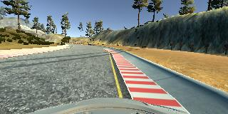

# **Behavioral Cloning** 

## Writeup

---

**Behavioral Cloning Project**

The goals / steps of this project are the following:
* Use the simulator to collect data of good driving behavior
* Build, a convolution neural network in Keras that predicts steering angles from images
* Train and validate the model with a training and validation set
* Test that the model successfully drives around track one without leaving the road
* Summarize the results with a written report

## Rubric Points
### Here I will consider the [rubric points](https://review.udacity.com/#!/rubrics/432/view) individually and describe how I addressed each point in my implementation.  

---

### Files Submitted & Code Quality

#### 1. Submission includes all required files and can be used to run the simulator in autonomous mode

My project includes the following files:
* model.py containing the script to create and train the model
* drive.py for driving the car in autonomous mode
* model.h5 containing a trained convolution neural network 
* writeup_report.md or writeup_report.pdf summarizing the results
* video.mp4 of car driving more than one lap on track 1 in autonomous mode

#### 2. Submission includes functional code
Using the Udacity provided simulator and my drive.py file, the car can be driven autonomously around the track by executing 
```sh
python drive.py model.h5
```

#### 3. Submission code is usable and readable

The model.py file contains the code for training and saving the convolution neural network. The file shows the pipeline I used for training and validating the model, and it contains comments to explain how the code works.

### Model Architecture and Training Strategy

Here is the code for my model:

```python
model = Sequential([
    # normalize the data
    Lambda(lambda x: x / 255.0 - 0.5, input_shape=image_shape),

    # remove top / bottom part of the image, they contain data that is mostly not useful
    Cropping2D(cropping=((70, 25), (0, 0))),

    # convolutional layers + pooling
    Convolution2D(24, 3, 3, activation='relu', subsample=(2, 2)),
    Convolution2D(36, 3, 3, activation='relu', subsample=(2, 2)),
    Convolution2D(48, 3, 3, activation='relu', subsample=(2, 2)),
    Convolution2D(64, 3, 3, activation='relu'),
    Convolution2D(64, 3, 3, activation='relu'),

    # some fully connected layers, added dropout to reduce overfitting
    Flatten(),
    Dropout(0.5),
    Dense(100),
    Dropout(0.5),
    Dense(50),
    Dropout(0.5),
    Dense(10),
    Dense(1)
])
```

#### 1. An appropriate model architecture has been employed

My model consists of a convolution neural network with 3x3 filter sizes and depths between 24 and 64.

The model includes RELU layers to introduce nonlinearity, and the data is normalized in the model using a Keras lambda layer.

#### 2. Attempts to reduce overfitting in the model

The model contains 3 dropout layers in order to reduce overfitting.
The model was trained and validated on different data sets to ensure that the model was not overfitting. Code:

```python
samples = load_all_samples()
train_samples, validation_samples = train_test_split(samples, test_size=0.2)
```

The model was tested by running it through the simulator and ensuring that the vehicle could stay on the track.

#### 3. Model parameter tuning

The model used an adam optimizer, so the learning rate was not tuned manually:

```python
model.compile(loss='mse', optimizer='adam')
```

#### 4. Appropriate training data

Training data was chosen to keep the vehicle driving on the road. I used a combination of:

- center lane driving
- recovering from the left and right sides of the road
- driving the track backwards
- driving to the inner side of curves
- driving to the outer side of curves

For details about how I created the training data, see the next section. 

### Model Architecture and Training Strategy

#### 1. Solution Design Approach

The overall strategy for deriving a model architecture was to choose a CNN that was complex enough to not underfit the data,
and then feed it with enough valid driving data to improve the model.

For collecting data I chose to store the data of each simulation run in a single folder. That way I was able to quickly
include or exclude driving runs - helping me in deciding whether a recorded run would help or hurt my model. For example,
I recorded a folder named `01_track1_forward` at a very early stage and later excluded it because my first ride was at
high speed and I didn't keep the car in the center very well. `track1_forward_center` however was a very
good run which I kept in my `driving_data` directory all the time.

My first step was to use a convolution neural network model similar to the
[Keras CNN based on LeNet](https://www.kaggle.com/ftence/digit-recognizer/keras-cnn-inspired-by-lenet-5). I thought this
model might be appropriate because it contained most of the layers I wanted: convolutional, pooling, dropout and
fully connected. Also, during my first tests with driving data both the training + validation data were low
(between 0.02 and 0.03), which was a good sign my model was nor overfitting, neither underfitting. Only an increase in
the number of epochs would lead to an increase in validation loss, so I kept the number of epochs between 1 and 3.
 
Later I switched to a CNN similar to the [CNN created by NVIDIA](https://arxiv.org/pdf/1604.07316v1.pdf).

Most of the time I spent on collecting new data with the simulator in order to improve the driving behavior.
By running my model in the simulator I saw how well the car was driving around track one.
There were a few spots where the vehicle fell off the track. To improve the driving behavior in these cases, I added one
more center run, I recorded one run where I would drive the car from the sides back to the center, and I drove the track
backwards.

My breakthrough came when I added two more runs: driving the car to the inner & outer side of the curves.

At the end of the process, the vehicle is able to drive autonomously around the track without leaving the road.

#### 2. Final Model Architecture

Here is how my final model architecture looks like, implemented in Keras:

```python
model = Sequential([
    Lambda(lambda x: x / 255.0 - 0.5, input_shape=image_shape),
    Cropping2D(cropping=((70, 25), (0, 0))),
    Convolution2D(24, 3, 3, activation='relu', subsample=(2, 2)),
    Convolution2D(36, 3, 3, activation='relu', subsample=(2, 2)),
    Convolution2D(48, 3, 3, activation='relu', subsample=(2, 2)),
    Convolution2D(64, 3, 3, activation='relu'),
    Convolution2D(64, 3, 3, activation='relu'),
    Flatten(),
    Dropout(0.5),
    Dense(100),
    Dropout(0.5),
    Dense(50),
    Dropout(0.5),
    Dense(10),
    Dense(1)
])
```

#### 3. Creation of the Training Set & Training Process

Here is the console output of Keras/TensorFlow after training my final model, which also shows which data I
used to train my model:
```
(carnd-term1) marc@flincdroid:~/selfdriving/CarND-Behavioral-Cloning-P3$ python model.py
Using TensorFlow backend.
I tensorflow/stream_executor/dso_loader.cc:128] successfully opened CUDA library libcublas.so locally
I tensorflow/stream_executor/dso_loader.cc:128] successfully opened CUDA library libcudnn.so locally
I tensorflow/stream_executor/dso_loader.cc:128] successfully opened CUDA library libcufft.so locally
I tensorflow/stream_executor/dso_loader.cc:128] successfully opened CUDA library libcuda.so.1 locally
I tensorflow/stream_executor/dso_loader.cc:128] successfully opened CUDA library libcurand.so locally
loading driving_data/track1_forward_center2
loading driving_data/track1_forward_recovery
loading driving_data/track2_forward_center
loading driving_data/track1_forward_outeredge
loading driving_data/track2_forward_leftlane
loading driving_data/track2_forward_center2
loading driving_data/track2_forward_rightlane
loading driving_data/track1_backward_center
loading driving_data/track2_backward_center
loading driving_data/track1_forward_center
loading driving_data/track1_forward_inneredge
input: 66717 training and 16680 validation samples
image shape: (160, 320, 3)
Epoch 1/2
I tensorflow/stream_executor/cuda/cuda_gpu_executor.cc:937] successful NUMA node read from SysFS had negative value (-1), but there must be at least one NUMA node, so returning NUMA node zero
I tensorflow/core/common_runtime/gpu/gpu_device.cc:885] Found device 0 with properties:
name: GeForce GTX 660
major: 3 minor: 0 memoryClockRate (GHz) 1.0975
pciBusID 0000:01:00.0
Total memory: 1.95GiB
Free memory: 1.83GiB
I tensorflow/core/common_runtime/gpu/gpu_device.cc:906] DMA: 0
I tensorflow/core/common_runtime/gpu/gpu_device.cc:916] 0:   Y
I tensorflow/core/common_runtime/gpu/gpu_device.cc:975] Creating TensorFlow device (/gpu:0) -> (device: 0, name: GeForce GTX 660, pci bus id: 0000:01:00.0)
133434/133434 [==============================] - 172s - loss: 0.0466 - val_loss: 0.0378
Epoch 2/2
133434/133434 [==============================] - 168s - loss: 0.0355 - val_loss: 0.0319
```

As you can see, my final model used both data from track 1 as well as track 2. But my first model that was able to
complete track 1 autonomously only used the data from track 1. Here you can see some examples of the input data:

#### Center driving


#### Center driving (opposite direction)


##### Recovering (track 1 only)




##### Driving to the inner/outer side of curves


To augment the data set, I also flipped images and negated the angle of the flipped image, hoping that my model
would not learn to only drive in just one direction.

After the collection process I had 166794 number of data points (83397 originals, but twice as much due to flipping).

While the complete driving data of track 1 would fit into the RAM of my target machine, I had to refactor the code to
use generators to be able to process the data of both tracks.
I split my data set into a training set of 80% and a validation set of 20%. The optimal number of epochs for my final model was 2.

Although the validation loss decreased continuously when training for 5 epochs, I observed that model to
perform worse in the simulator than a model that trained for 2 epochs. Because of this I decided to stop training after
2 epochs. One explanation could be that the validation data was too similar to the training data, leading to an overfitting
of the model and worse performance on previously unseen examples (like real driving in the simulator).


Right now, my model works well on track 1, but operates poorly on track 2. This can probably be improved by adding
one or more laps of recovery driving on track 2. You can see the final video of track 1 [here](video.mp4).

You can download my [driving data for track 1](https://drive.google.com/open?id=0B1BT_B4FwQK3V2ZHTHBTeXZaSWs).
I am looking forward to publish the driving data of track 2 as well as soon as my model performs well on both tracks.
